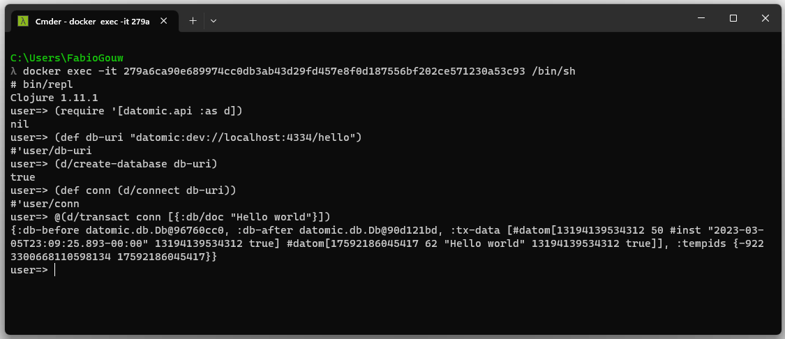

# Datomic Starter docker image

This repository contains the source code for a docker image for running Datomic Starter edition. I made this one to easily spin up a dev / test environment, so I can use it to run integration tests using libraries like [Test Containers](https://www.testcontainers.org/).

This image is based on the clojure official image. It starts both the Datomic's transactor (the one that receives the writes requests and stores them) and the [Datomic console](https://docs.datomic.com/on-prem/other-tools/console.html), so I can use it to query the database.

Datomic Starter edition requires an exclusive license and this is the reason I didn't expose the image on my Docker Hub's account (otherwise people would use my license). However, this license has no cost and can be used for 1 year after getting it. So if you would like to use this image, you'll just need to [grab your license](https://www.datomic.com/get-datomic.html), clone this repo and build this image.

After cloning the repo, in the terminal using a machine that has Docker installed, go to the *src* folder and run the command below, replacing the following parameters:
- **your-email** - the e-mail you've used to register in Datomic's web site
- **downloading-password** - the download password the site provides to you. It's an UUID and it's not your password (the one you've used to register)
- **datomic_version** - the Datomic version you want to use. It's optional and if not provided, the default value is 1.0.6610
- **your-license** - the license you've received after registered. It's a multiline string composed of letters and numbers. Don't forget to remove the "\\" characters at the end of each line and join the lines into one.

All these information can be obtained in Datomic's account page.

``` bash
docker build -t my-datomic-starter:0.1 --build-arg http_user={{your-email}} --build-arg http_password={{downloading-password}} --build-arg datomic_version={{datomic_version}} --build-arg datomic_license={{your-license}} . 
```

As an example:

``` bash
docker build -t my-datomic-starter:0.1 --build-arg http_user=my-email@email.com --build-arg http_password=6a83fbdc-0fda-4745-9893-6b163d130b1e --build-arg datomic_version=1.0.6610 --build-arg datomic_license=5XIaAdcPkKwD9fMGmmRX0GYN37W5xM5WiBWDDKP2f8xH7IQHfi/aM3PmTh0wxa06woh14hZi5hOaYvLfYfZrb5Pswlqm0cgBNdhzndWs5CuEmfmP90z9kCzfM02krfaDsY8KzbOpUlQbQ/AIUHhb1bpyuvajqPyINpHhO2WwJ15o2r3t0Pcr1w8uDswW8nOQ6hydelo9qz8wkLtFJyZhe2pZt7IDlxrpSJyUJMJ0g9x11ZcTWBXJqanVyOrzV56VwaUDRaKGkSUWED7wc/jRNne1Zz21xXqyzpL8FGD65MNrC8ciVRXxFDB2f1B3RxbkCkCPTIkvzt7m7TOgoTAeEpKL . 
```

To run, you just need to create the container.

``` bash
docker run -d -p 8080:8080 -p 4334:4334 my-datomic-starter:0.1
```

Go to [http://localhost:8080/browse](http://localhost:8080/browse) and you'll have access to the Datomic console. Also, you can connect to the containter to get access to the shell and start a new REPL instance to interact with Datomic (in the image below, there's and exemple on how to do it and create a new database and insert some datoms on it).

